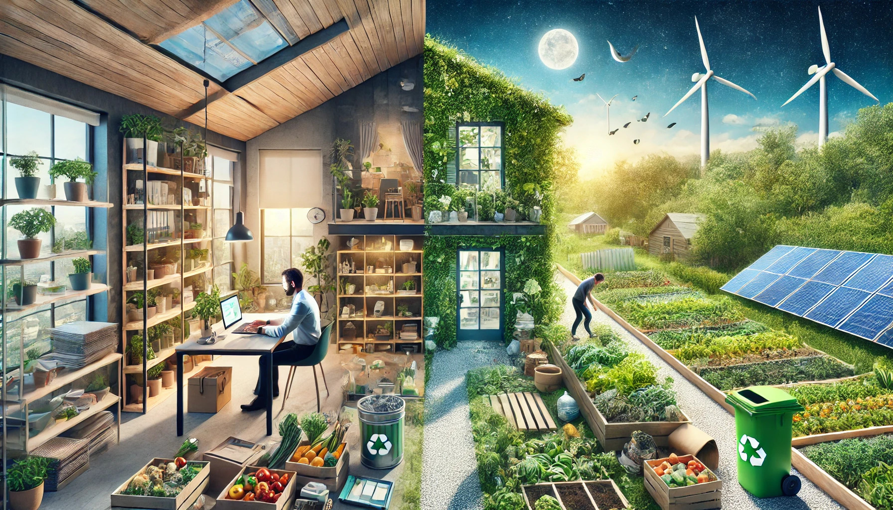

# Sostenibilidad

## Índice

1. [Introducción](introduccion.md)
2. [Desempeño profesional y personal](desempeño.md)
3. [Riesgos y oportunidades que representan los ODS](riesgos.md)
4. [Medidas y oportunidades para atender los retos ambientales desde el entorno personal y profesional](medidas.md)
5. [Prácticas sostenibles en el ambiente personal](practica.md)
6. [Conclusiones](conclusiones.md)
7. [Mapa conceptual](mapa.md)
8. [Glosario](glosario.md)
9. [Referencias](referencias.md)
10. [Autores](autores.md)
