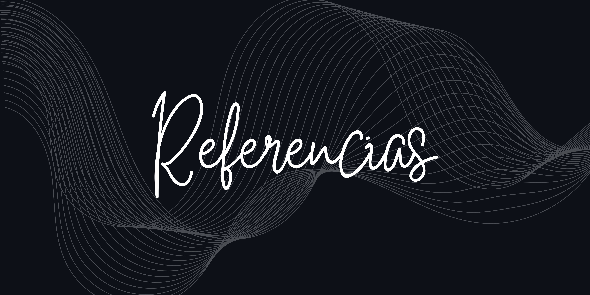

1. [EUROAULA](https://www.euroaula.com/es/desarrollo-profesional-y-personal) 
2. [Femcet](https://femcet.com/es/objetivos-de-desarrollo-sostenible-u-ods-que-son-y-agenda-2030/?gad_source=1&gclid=Cj0KCQiA0--6BhCBARIsADYqyL-vz9MHeeAnmYXHpapljuwKvPCxqDoknL0ZZnQqyoavPC902qjUBEEaAn2hEALw_wcB)
3. [Fairchange](https://www.fairchangeimpact.com/es/) [Expok](https://www.expoknews.com/)
4. [Psicología y Mente](https://psicologiaymente.com/psicologia/diferencias-entre-desarrollo-personal-y-desarrollo-profesional)
