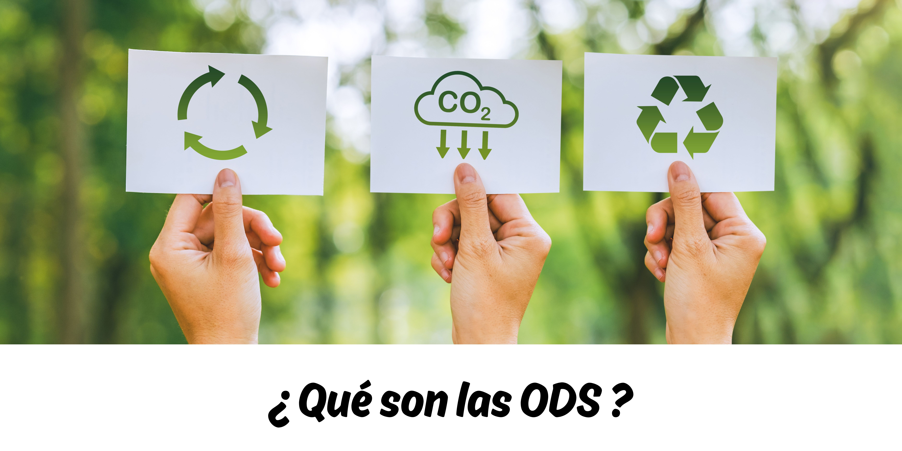

Los Objetivos de Desarrollo Sostenible (ODS), creados por la ONU en 2015, son una agenda global de 17 objetivos y 169 metas para abordar retos mundiales, con el compromiso de 193 países para cumplirlos antes de 2030.

# Riesgos y Oportunidades de los ODS

| **Categoría**   | **Descripción**                                                                                             |
|------------------|-----------------------------------------------------------------------------------------------------------|
| **Riesgos:**      |                                                                                                           |
| Costos de inacción | Ignorar los ODS puede ocasionar conflictos sociales y ambientales, pérdida de competitividad y costos significativos (hasta un tercio del PIB global). |
| Cambios regulatorios | Las nuevas normativas sobre sostenibilidad representan desafíos para las empresas no alineadas con los ODS. |
| Impactos climáticos y sociales | La falta de gestión en cambio climático o derechos humanos puede afectar cadenas de suministro y operaciones. |
| **Oportunidades:** |                                                                                                          |
| Nuevos mercados | Crecimiento de la demanda de productos y servicios sostenibles, especialmente en economías emergentes. |
| Gestión de riesgos ESG | Mitigación de riesgos ambientales, sociales y de gobernanza, mejorando la resiliencia organizacional. |
| Innovación       | Desarrollo de soluciones y modelos de negocio sostenibles como infraestructura verde y eficiencia energética. |
| Reputación y fidelización | Mejora de la reputación corporativa y atracción de clientes y empleados con valores sostenibles. |

¿Con qué ODS está relacionado la industria, la innovación y la infraestructura?

